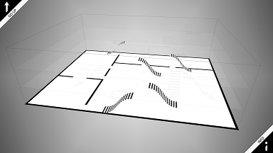
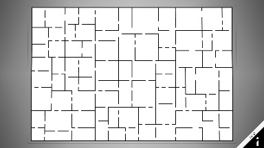
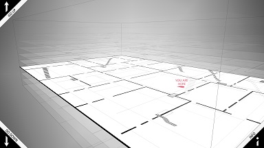

# Meiro
Meiro is a gaming environment populated with interactive 3D models.
It is a successor of the FMI-3D project. Currently Meiro contains
over 300 models covering different topic from Computer Graphics.
Meiro is used in the course "Fundamentals of Computer Graphics" for
Computer Sciences undergraduate students from the
[Faculty of Mathematics and Informatics](https://www.fmi.uni-sofia.bg/en) at
[Sofia University](https://www.uni-sofia.bg/index.php/eng). 

# Important note
The Meiro project is currently being githubbed. It will take some
time until the old code is refactored and polished. This document
will present on the elements that are fixed.

# Floor plan
During the game students may view the floor plan of Meiro. This is
a map of floors, rooms, locations of models, etc.

Click on an image to run examples of different Meiros. As they are
randomly generated at run time, they will appear with different 
allocation of rooms.

# Meiro parameters

Meiro passes configuration data as parameters embedded in the web address:

* `id=&#119821;` &ndash; building id &#119821;, a number defining the structure of the building. A random id is used if the id is missing or is 0. There is no default value. Example: `id=3`.

* `size=*X*x*Y*x*Z*` &ndash; building size, a string of three integer numbers: *X* and *Z* are the horizontal sizes of the building, *Y* is the number of floors. By default size is `size=20x3x15`.

					<li><code>stairs</code> &ndash; желан, но негарантиран, брой стълби между два съседни етажа. По подразбиране е 5.</li>
					<li><code>split</code> &ndash; разделяне на лабиринта, стринг от три числа &ndash; <em>minRoom</em>, <em>maxRoom</em> и <em>extraDoors</em>, разделени с x-ове. <em>minRoom</em> е цяло число за минималния размер на остатъчна стая при рязане на стая на две. Ако стая е с размер по-голям от <em>maxRoom</em> (също цяло число), то тя ще бъде разделена. <em>extraDoors</em> е дробно число, което се умножава с дължината на стена и определя колко най-много случайни допълнителни врати ще има, освен задължителната една врата. По подразбиране е 3x8x0.1.</li>
					<li><code>pos</code> &ndash; начална позиция на играча, стринг от четири дробни числа &ndash; <em>X</em>, <em>Y</em>, <em>Z</em> и <em>Angle</em>, разделени с x-ове. <em>X</em> и <em>Z</em> са хоризонталните координати в лабиринта, <em>Y</em> е на кой етаж е играчът (ако е дробно число, играчът е на стълби между етажи), а <em>Angle</em> е посоката на гледане представена като ъгъл в радиани. Няма стойност по подразбиране.</li>
					<li><code>zoom</code> &ndash; диапазон на максимално приближаване или отдалечаване в режим на карта. Ако е 10, то образът може да се мащабира от x0.1 до x10. По подразбиране е 1.</li>
					<li><code>texture</code> &ndash; параметър за използвани текстури за лабиринта, стринг. Ако е <em>no</em>, <em>none</em> или <em>false</em> не се ползват текстури. Ако е <em>yes</em>, <em>true</em> или <em>default</em> се ползва основната текстура (сини линии на фон на точки). Ако е <em>debug</em> или <em>grid</em> се ползва текстурата по подразбиране с насложена квадратна координатна мрежа. Стойността по подразбиране е <em>true</em>.</li>
					<li><code>ao</code> &ndash; параметър за използвано околно засенчване (ambient occlusion). Ако е <em>no</em>, <em>none</em> или <em>false</em> не се ползва засенчване. Ако е <em>yes</em>, <em>true</em>, <em>default</em> или <em>fssao</em> се ползва основното засенчване с фалшиво SSAO. Ако е <em>sao</em>, <em>ssao</em> или <em>nnsao</em> се ползва съответно SAO, SSAO или NNSAO засенчване. Стойността по подразбиране е <em>fssao</em>.</li>
					<li><code>modeloverlay</code> &ndash; параметър без стойност, самото му съществуване предизвиква рисуване на модела в стая над образа на стаята (дори и след евентуално околно засенчване) &ndash; по-красив модел, но е насложен над лабиринта. Ако липсва, моделът се рисува вътре в сцената и при някои засенчвания се получават ореоли.</li>
					<li><code>lowpoly</code> &ndash; параметър без стойност, самото му съществуване предизвиква генериране на обекти с по-малко стени. Ако липсва, стените са повече на брой и обектите са по-гладки.</li>
					<li><code>back</code> &ndash; URL адрес, на който да се премине след излизане от текущата страница. Например, <em>blueprint.html</em> го използва, за да се върне обратно към <em>player.html</em>. Няма стойност по подразбиране.</li>
					<li><code>model</code> или <code>models</code> &ndash; списък от имена на модели, които да се заредят и разпределят по стаите на лабиринта. Имената са разделени със запетайки, например: <em>m00001,m00002,m00003</em>. Няма стойност по подразбиране.</li>
					<li><code>lang</code> &ndash; език на показваните текстове: <em>en</em> или <em>bg</em>. По подразбиране е <em>en</em>.</li>
				</ul>
			

