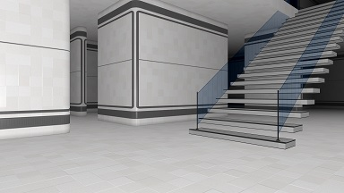
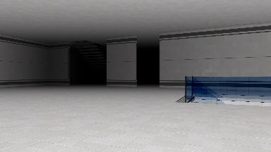
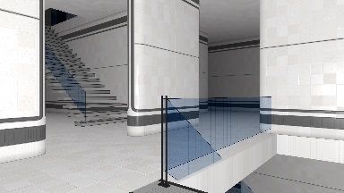

# Meiro
Meiro is a gaming environment populated with interactive 3D models.
It is a successor of the FMI-3D project. Currently Meiro contains
over 300 models covering different topic from Computer Graphics.
Meiro is used in the course "Fundamentals of Computer Graphics" for
Computer Sciences undergraduate students from the
[Faculty of Mathematics and Informatics](https://www.fmi.uni-sofia.bg/en) at
[Sofia University](https://www.uni-sofia.bg/index.php/eng). 

# Important note
The Meiro project is currently being githubbed. It will take some
time until the old code is refactored and polished. This document
will present the elements that are fixed.

# Floor plan
During the game students may view the floor plan of Meiro. This is
a map of floors, rooms, locations of models, etc.

Click on an image to run examples of different Meiros. As they are
randomly generated at run time, they will appear with different 
allocation of rooms.

# Meiro dungeon

Meiro is a closed building, i.e. there is no entrance or exit. t is split in rooms and every room could be accessed from any other room.

Click on the image to run an example is an empty Meiro (medium, sparse and dense layouts).

# Meiro parameters

Meiro passes configuration data as parameters embedded in the web address.

<!-- https://www.compart.com/en/unicode/block/U+1D400 -->
<!-- 𝐀𝐁𝐂𝐃𝐄𝐅𝐆𝐇𝐈𝐉𝐊𝐋𝐌𝐍𝐎𝐏𝐐𝐑𝐒𝐓𝐔𝐕𝐖𝐗𝐘𝐙 -->

### Topology

* `id=𝐍` &ndash; dungeon id 𝐍, a number defining the structure of the dungeon. A random id is used if the id is missing or it the id is 0. There is no default value. Example: `id=3`.

* `size=𝐗x𝐘x𝐙` &ndash; dungeon size, a string of three integer numbers: 𝐗∈[4,100] and 𝐙∈[4,100] are for the horizontal sizes of the dungeon, 𝐘∈[1,30] is the number of floors. By default size is `size=20x3x15`.

* `stairs=𝐍` &ndash; maximal number of stairs 𝐍∈[0,200] between two floors. Depending on the dungeon layout the number of actual stairs could be less. By default `stairs=5`.

* `rooms=𝐍` &ndash; maximal number 𝐍∈[1,100000] of rooms in the whole dungeon. By default `rooms=10`.

* `split=𝐌𝐈𝐍x𝐌𝐀𝐗x𝐃` &ndash; splitting into rooms, a string of three numbers. The rooms of each floor are generating by splitting larger rooms into smaller rooms. 𝐌𝐈𝐍∈[1,30] is an integer number for the minimal size of a room after splitting. If a room is larger than 𝐌𝐀𝐗∈[1,100] (also an integer number), it could be split if needed. A room is split by addind a wall with at least 1 door. The floating number 𝐃∈[0,1] multiplied by the wall length defines the number of additional doors in the wall. By default `split=3x8x0.1`.

### Content

* `pos=𝐗x𝐘x𝐙x𝐀</code> &ndash; player position, a string containg four floating point numbers. A sign *"You are here"* is placed at position (𝐗,𝐘,𝐙) and pointing toward direction 𝐀 - an angle in radians. If `pos` is missing, there will be no sign. No default value.

* `model=𝐌₁,𝐌₂,𝐌₃,....𝐌ₙ` or `models=𝐌₁,𝐌₂,𝐌₃,....𝐌ₙ` &ndash; a list of models names. These models are placed in the largest rooms. No default value.</li>

### Interface

* `back` or `back=𝐔𝐑𝐋` &ndash; shows a button for closing the current page. If 𝐔𝐑𝐋 is defined it defines the returning URL address. No default value.

* `zoom=𝐍` &ndash; zoom factor, the floating point number 𝐍∈[1,10] defines the maximal zoom-in and zoom-out. For example, `zoom=10` allows zooming from x0.1 to x10. By default `zoom=3`.

* `lowpoly` &ndash; a parameter without a value. It existence hints Meiro to use simpler objects in attempt to make graphics faster. If not defined, Meiro uses more complex objects. No default value.
					
* `lang=𝐋` &ndash; string for the interface language 𝐋∈[`en` (English), `bg` (Bulgarian)]. If undefined, Meiro switches to English as if it is `lang=en`. No default value.

January 2021